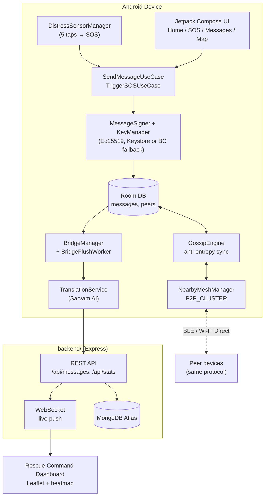

# PulseNet — Asynchronous Survival Mesh Network

> Built for MUJ HackX 4.0. Android app + rescue command dashboard for disaster
> scenarios where cellular and internet infrastructure is down.

## The Problem

When a disaster takes out cell towers and internet, phones become islands.
Existing "offline mesh" apps that try to fix this usually fail in practice
because continuous Bluetooth/Wi-Fi scanning triggers Android's Doze Mode and
drains the battery within hours — exactly when people need their phones to
last the longest.

PulseNet takes a different approach: an **asynchronous, sensor-triggered mesh
protocol**. The app sleeps like a submarine — duty-cycled discovery instead of
continuous scanning — and only wakes radios under disciplined conditions or
when a physical sensor pattern signals distress. When a phone eventually
reaches a cell signal or Wi-Fi, it bridges everything the mesh collected back
to a cloud database and a live rescue command dashboard.

## Architecture



Nearby Connections only gives direct M-to-N links between peers — it does
**not** route messages through intermediate nodes. Multi-hop delivery is
implemented on top of it by `GossipEngine`, using a stateless anti-entropy
protocol: on connect, each side sends a `HASH_LIST` of message IDs it has, and
on receiving the other side's list, pushes back a `MESSAGE_BATCH` of whatever
it's missing. SOS messages transfer first; a hop counter (max 7) stops
messages from propagating forever.

## Tech Stack

| Layer | Choice | Why |
|---|---|---|
| Language | Kotlin | Coroutines/Flow throughout, no Java interop overhead |
| UI | Jetpack Compose + Material3 | Fast to build panic-proof, high-contrast screens |
| DI | Hilt | Standard for hackathon judging, testable seams |
| Local storage | Room | Realm/Atlas Device SDK is deprecated; Room is the maintained Jetpack standard |
| Mesh transport | Nearby Connections (P2P_CLUSTER) | Only strategy supporting M-to-N mesh topology |
| Wire format | Moshi JSON over BYTES payloads | Codegen adapters, no reflection at runtime |
| Crypto | Ed25519 (AndroidKeyStore attempt → Bouncy Castle fallback) | Hardware Ed25519 support is inconsistent across devices |
| Background work | WorkManager + a foreground Service | Doze-resistant sensor listening and duty-cycled discovery |
| Offline maps | OSMDroid | Works fully offline with cached tiles, unlike Google Maps |
| Cloud sync | Custom Express/MongoDB backend | Keeps DB credentials out of the shipped APK; see [Note on MongoDB Atlas](#note-on-mongodb-atlas) |
| Translation | Sarvam AI | 22 Indian languages + Hinglish, used to normalize distress messages before triage |
| Dashboard | Leaflet + leaflet.heat, no build step | Fast to stand up, works from a single static folder |

## Project Structure

```
HackXMUJ/
├── app/                        Android app (com.pulsenet.app)
│   └── src/main/java/com/pulsenet/app/
│       ├── data/                Room entities/DAOs, remote API, repositories
│       ├── domain/               Domain models + use cases
│       ├── mesh/                 NearbyMeshManager, GossipEngine, MeshService, BridgeManager
│       ├── security/             KeyManager, MessageSigner, Ed25519Crypto
│       ├── sensor/                DistressSensorManager, ShakePatternDetector, LocationProvider
│       ├── worker/                BridgeFlushWorker, EvictionWorker
│       └── ui/                    Compose screens (onboarding, home, sos, messages, map)
├── backend/                    Rescue command dashboard (Express + MongoDB + WebSocket)
│   ├── server.js
│   └── public/                  Leaflet dashboard (index.html, app.js, style.css)
├── ImplementationPlan.md       Original hackathon build plan
└── BuildPhases.md              Phase-by-phase breakdown with done-when checklists
```

## Setup

### Android app

1. Install JDK 17 and the Android SDK (platform 34, build-tools 34.0.0, platform-tools).
2. Create `local.properties` in the project root (git-ignored) with:
   ```properties
   sdk.dir=/path/to/your/Android/Sdk

   BACKEND_BASE_URL=http://10.0.2.2:3000/
   SARVAM_API_KEY=your_sarvam_key
   SARVAM_BASE_URL=https://api.sarvam.ai
   ```
   `10.0.2.2` reaches your host machine from the Android emulator. For a
   physical test device on the same Wi-Fi, use the backend host's LAN IP
   instead (e.g. `http://192.168.1.42:3000/`).
3. Build and test:
   ```bash
   ./gradlew assembleDebug
   ./gradlew testDebugUnitTest
   ./gradlew connectedDebugAndroidTest   # requires a connected device/emulator
   ```
4. Install on a device: `./gradlew installDebug`, or copy the APK from
   `app/build/outputs/apk/debug/`.

### Backend / dashboard

1. Provision a MongoDB Atlas cluster (free M0 tier is enough), database
   `pulsenet`, collection `messages`. Grab the connection string.
2. `cd backend && npm install`
3. Edit `backend/.env`:
   ```
   MONGO_URI=your_atlas_connection_string
   PORT=3000
   ```
4. `npm start` → dashboard at `http://localhost:3000`.

### Note on MongoDB Atlas

MongoDB has been retiring Atlas App Services, including the Data API — the
same deprecation wave that already took down Realm/Device Sync. Rather than
have the Android app call Atlas's Data API directly (which would also mean
shipping a database API key inside the APK), the Bridge sync path POSTs to
**our own backend's** `/api/messages/bulk` endpoint, which then writes to
MongoDB via the normal driver. Only `MONGO_URI` is needed server-side; the
Android app never sees database credentials.

## Feature Highlights

- **Sensor-triggered SOS**: 5 sharp accelerometer spikes (>15 m/s², within 3s)
  trigger an SOS even with the screen off or the phone locked — tap the back
  of the phone 5 times rapidly.
- **Signed messages**: every message carries an Ed25519 signature; tampered
  messages are dropped silently by receivers.
- **Anti-entropy gossip**: messages spread hop-by-hop across the mesh without
  needing continuous connectivity to any single peer.
- **Battery discipline**: 30s discovery windows every 5 minutes, switching to
  continuous discovery only while an SOS is active.
- **Bridge mode**: the moment any device reaches internet, it flushes cached
  mesh traffic to the cloud — Sarvam-translated and severity-tagged along the
  way — so the rescue dashboard reflects things that happened entirely
  offline.

## Testing

35 JVM unit tests cover the parts that don't need a device: Ed25519
sign/verify + tamper rejection, gossip hash-delta computation/TTL/priority
sorting, the SOS tap-pattern detector (including cooldown), cloud-sync
batching/GeoJSON ordering/retry-on-failure, and Sarvam translation + severity
classification.

```bash
./gradlew testDebugUnitTest
```

Room DAO behavior (dedup, eviction, SOS-never-evicted) is covered by an
instrumented test requiring a device/emulator:

```bash
./gradlew connectedDebugAndroidTest
```

Multi-device mesh behavior (discovery, hop propagation, dedup across real
BLE links, SOS broadcast) can only be verified on physical hardware — see
`BuildPhases.md` Phase 6 for the manual test matrix.

## Known Deviations from the Original Plan

- **Cloud sync targets our own backend, not Atlas's Data API directly** — see
  [Note on MongoDB Atlas](#note-on-mongodb-atlas) above.
- **Voice notes and the ultrasonic audio fallback (original Phase 10) were
  descoped** to prioritize demo polish; the ultrasonic path in particular
  depended on a third-party library that wasn't verified to still be
  maintained.
- **Peer positions aren't plotted on the map** — GossipEngine exchanges
  message content (which carries its own origin coordinates), not peer GPS
  positions, so only message pins and the device's own location are shown.

## Team

- Ronit Kumar
- Aditya Negi
- Mayank Singh Pargai
- Vivek Kumar Singh
